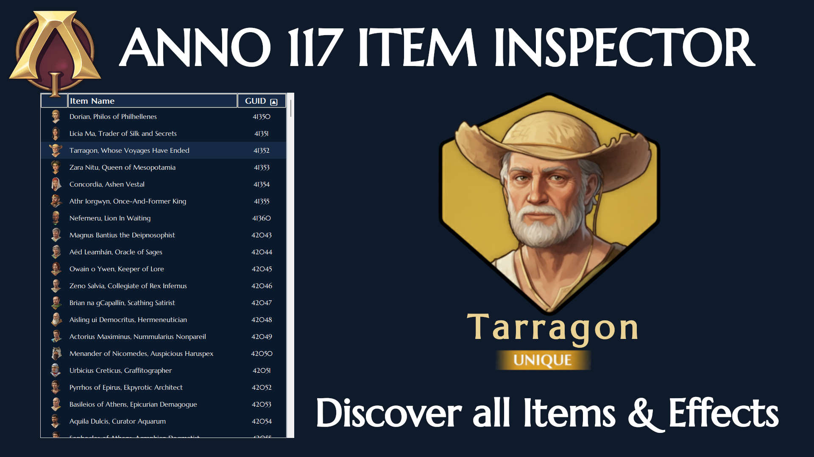
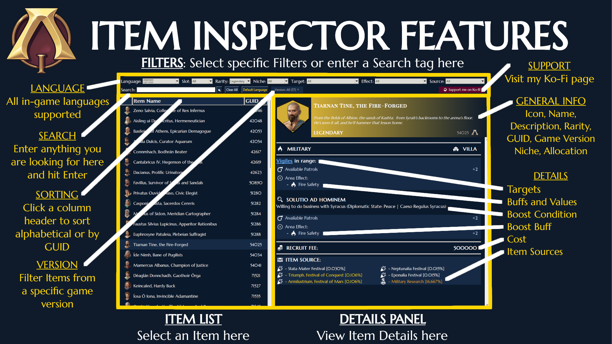

# ANNO 117 Item Inspector

A standalone desktop utility designed to browse, filter, and analyze item data for ANNO 117: Pax Romana. This tool provides a deep-dive interface for the game's item data, allowing players to find the perfect specialist or captain for their next Roman empire.

-> Deutsches Readme findet ihr [hier](readme_german.md)

# Features

- Complete Database: Contains every item currently available in ANNO 117: Pax Romana.
- Full Multi-Language Support: Available in all official in-game languages. The data automatically adapt to your preferred language. Set your default startup language once or change it on the fly.

## Comprehensive Item Data
Every item entry is broken down into two distinct sections:

### General Information
- Visuals: Item Icon and Name.
- Context: Flavor Text and Niche.
- Metadata: Rarity, GUID, Game Version, and Allocation.

### Deep Dive Details
- Targets: Which buildings or units are affected - for multi-target items (using Asset Pools), hover over the light blue underlined Asset Pool name to see all individual targets. Click to pin the tooltip.
- Buffs & Values: All item effects covered, with value percentages in a nicely presented layout.
- Boost Logic: Specific Boost Conditions and the corresponding Boost Buffs for legendary items.
- Item Costs
- Acquisition: All Item Sources (Traders, Contracts, Reward Pools, Quest Rewards, or specific Research) with probabilities where applicable. Hover over the Item Source Header to get a legend for interpreting the icons in the list.

## Filtering System
- Multi-Category Search: Filter items by Rarity, Allocation, Niche, Target, Effects and Source.
- Smart Effect Merging: A unified filtering logic that merges similar attributes across different data types.
- Game Version history: Filter for items introduced in specific game versions (for future DLC releases)
- "Intelligent" Search Bar: You can manually search for (parts of the) item name, GUID, (parts of the) effect names, targets etc. Just type in what you are looking for and hit Enter or press the search button.
- Clear all Filters by pressing the "Clear All" Button.

# Getting Started
- Download the standalone exe file from the Releases, place it anywhere on your PC and double-click to start.
- If you want to run the script locally:
  - Prerequisites:
    - Python 3.10 or higher
    - Tkinter (usually included with Python)
  - Installation:
    - Clone the repository
    - Run the extract_assets_resolve_pools_buffs_conditions_sources.py script to generate a fresh csv file - update the game assets.xml and language files in the data folder if necessary (after game update).
    - Run the script anno117_item_inspector.py

# Known Issues
- Currently (v1.5 of the game) there are two items - first introduced into the assets with the Marvelous Mosaic cDLC and now moved to DLC01 - which indicate their sources to be the Hall of Fame, but Ubisoft has not yet updated the Hall of Fame to include new content after the first DLC. As the script cannot differentiate between server-site implemented HoF items and non-server site implemented HoF items, the Item Inspector displays these items, even though they are not (yet) obtainable.

# Credits
- DuxVitae for the idea of extracting item data to a csv file.
- Google Gemini for coding the majority of this project

# License
This project is licensed under the Creative Commons Attribution-NonCommercial-ShareAlike 4.0 International (CC BY-NC-SA 4.0).