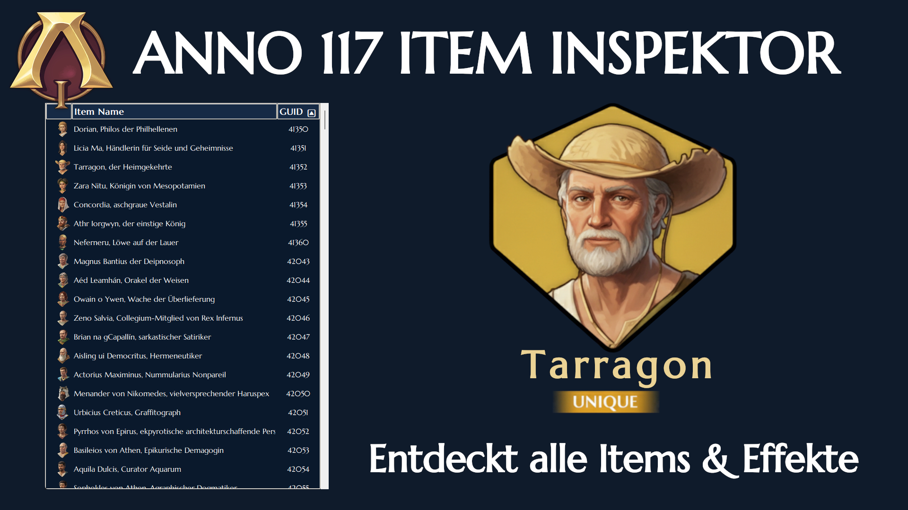
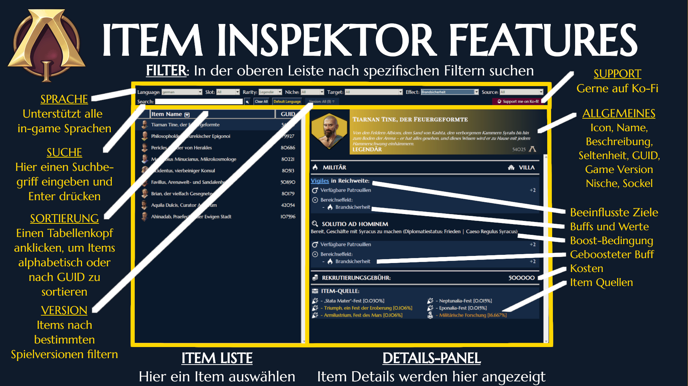

# ANNO 117 Item Inspector

Ein eigenständiges Desktop-Pogramm zum Durchsuchen, Filtern und Analysieren von Item-Daten für ANNO 117: Pax Romana. Dieses Tool bietet eine detaillierte Benutzeroberfläche für die Item-Daten des Spiels, mit der Spieler den perfekten Spezialisten oder Kapitän für ihr nächstes Römisches Reich finden können.

# Features

- Vollständige Datenbank: Enthält alle derzeit in ANNO 117: Pax Romana verfügbaren Items.
- Vollständige Mehrsprachen-Unterstützung: Verfügbar in allen offiziellen Spiel-Sprachen. Die Daten passen sich automatisch an die eingestellte Sprache an. Einmalig die Standardsprache beim Start festlegen oder jederzeit über das "Language"-Menü ändern.

## Umfassende Item-Daten
Jeder Datenbankeintrag ist in zwei verschiedene Abschnitte unterteilt:

### Grundlegende Informationen
- Visuelle Elemente: Icon und Name des Items.
- Kontext: Subtext und Nische.
- Metadaten: Seltenheit, GUID, Spielversion und Sockel.

### Deep Dive Details
- Beeinflusste Gebäude/Einheiten: Welche Gebäude oder Einheiten werden beeinflusst – bei Items mit mehreren Zielen (unter Verwendung von Asset-Pools) kann der Mauszeiger über den hellblau unterstrichenen Namen des Asset-Pools bewegt werden, um alle einzelnen Ziele anzuzeigen. Durch einen Klick auf den Namen kann der Infotip angeheftet werden (zum Scrollen bei z.B. Macrobius).
- Buffs und Werte: Alle Itemeffekte werden mit ihren prozentualen Werten in einem übersichtlichen Layout dargestellt.
- Boost-Logik: Spezifische Boost-Bedingungen und die entsprechenden Boost-Buffs für legendäre Items.
- Kaufkosten
- Quellen: Alle Itemquellen (Händler, Verträge, Rewardpools, Questbelohnungen, Festivals oder spezifische Forschung) mit Angabe der Wahrscheinlichkeiten, sofern zutreffend. Bewegt den Mauszeiger über die Überschrift „Item-Quelle“, um eine Legende zur Interpretation der Symbole in der Liste anzuzeigen.

## Filter-System
- Suche über mehrere Kategorien: Filtert Items nach Seltenheit, Sockel, Nische, Ziel, Effekten und Quelle (steuerbar über zwei Dropdown-Menüs zur Auswahl der genauen Quelle).
- Intelligente "Effektzusammenführung": Eine einheitliche Filterlogik, die ähnliche Attribute über verschiedene Datentypen hinweg zusammenführt (Attribut alleine, Attribut durch geändertes Bedürfnis, extra Attribute durch Bereichseffekte).
- Spielversionsverlauf: Filtern der Items, die in bestimmten Spielversionen eingeführt wurden (für zukünftige DLC-Veröffentlichungen).
- "Intelligente" Suchleiste: manuell kann nach (Teilen des) Namen des Items, GUID, (Teilen des) Namens der Effekte, Zielen usw. gesucht werden. Einfach eingeben, wonach gesucht wird, und die Eingabetaste drücken oder die Suchschaltfläche betätigen.
- Durch den "Clear All" Button kann man den Filter komplett zurücksetzen.

# Getting Started
- Ladet die eigenständige EXE-Datei aus den Releases herunter, dann speichern an einem beliebigen Ort auf dem PC und doppelklicken, um das Programm zu starten.
- Wenn man das Skript lokal ausführen möchte:
  - Voraussetzungen:
    - Python 3.10 oder höher
    - Tkinter (in der Regel in Python enthalten)
  - Installation:
    - Das Repository klonen
    - Ausführen des Skripts "extract_assets_resolve_pools_buffs_conditions_sources.py" in der Konsole, um eine aktualisierte CSV-Datei zu generieren, davor gegebenenfalls die Datei „assets.xml“ und die Sprachdateien im data-Ordner updaten, wenn eine neue Game Version rausgekommen ist.
    - Ausführen des Skripts "anno117_item_inspector.py" startet das Programm.

# Known Issues

# Credits
- DuxVitae für die Idee, Item-Daten in eine CSV-Datei zu extrahieren.
- Google Gemini und Claude Code für die Programmierung des Großteils dieses Projekts.

# License
Dieses Projekt nutzt die Creative Commons Attribution-NonCommercial-ShareAlike 4.0 International (CC BY-NC-SA 4.0) Lizenz.